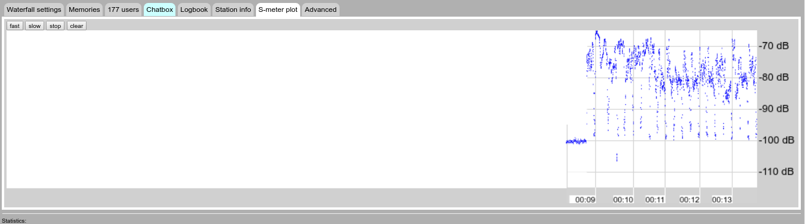

## Student Information

* **Name**: Jahir Gilberth Medina Lopez
* **USP Number**: 1659682

## Project Area(s)

### Main Area
  * Super-Resolution

### Secondary Area(S)
  * Feature Extraction
  * In-painting
  * Noise Reduction [\*]
  * Image Restoration
  * Sound Processing [\*]

[\*] As an auxiliary topic.

## Project Context

### Project Idea

The main idea of the project is retrieve damage images of sound data and return enhance sound data, the images are generated from sound signals.
The sound signals it self can be converted to images, but, during the sound data reception its possible to get analog images (as frequency "pictures" of sound, like an analog TV). This redundant data could help in the enhancement sound process, not only improving the sound quality filtering the sound data, also filtering the image data associated to the sound 

### Data Sources

#### University of Twente

[Wide-band WebSDR - Web Page](http://websdr.ewi.utwente.nl:8901)

The University of Twente posses a short-wave receiver located at the amateur radio club ETGD offices, who is offered free as an on-line radio.

They allow the possibility of multiple tune-it radio frequency, generating a wide spectrum of available frequencies [0 Mhz - ~30 Mhz]

Like it is looks, the image resulting of a complete day of registering frequencies posses a relative "pattern" behavior, in spite of it contents a lot of voice signals [ 0Mhz - 15 Mhz ].

### Inspirations

#### The ARSS Project

[The ARSS Project - Web Page](http://arss.sourceforge.net)

The ARSS Project could be considerer as the main inspiration for this project, it works the idea of sound reconstruction from images, however, the project was first develop for Sound-to-Image conversion.

The way it is works is converting images as if it were a frequency domain data, this method of Sound-from-Image Data Retrieve method is generic enough to convert any image to sound, being useful in this project.

[The ARSS Project - Examples](http://arss.sourceforge.net/examples.shtml)

  
  
  <audio controls="controls">
    <source type="audio/mp3" src="http://arss.sourceforge.net/examples/lena/lena.mp3"></source>
    
Your browser does not support this audio format (MP3).

  </audio>

## Project Objective(s)

### Principal Objective

  Find what method performs statistically better in the process of image enhance.

### Secondary Objectives
  * Test the efficiency in developing time and execution time

  * Compare the "human perceived" quality, having an 99% of accuracy not always mean have a nice sound

## Solution Steps
  * Get all the possible "General Data" that it gonna be use [Picture Above] ( 50~100 samples)
    * [2016-02-01 Full Day Image](http://websdr.ewi.utwente.nl:8901/fullday/day16832.png)
    * It also gonna be used some *music samples for the "human" quality test*

  * Get the sub samples relatives to the identified patterns in the general data
  * Find Match between all of them (same pattern) an proceed to increase the number of samples
  * Start the tests
  * Compare
  * Get Results

### Test Types
  
**The Project performs 3 different test :**

1. Using data to test every chosen method  , getting the best and the worst methods (quality of results)
2. Using the methods obtained, applying the same methods and comparing the accuracy of the "quality prediction"
3. Testing the methods in data who were not used in any of the steps before

**Types of Data**
  
  1. General Image:
    This kind of image represents the original data (sound) with compression in the time domain; representing, for example, 1 hour in an *2min length* image.
    
  2. Detailed Image:
    This kind of image represents the original data (sound) without compression in the time domain
    
    
  3. Specific Data:
    Is just the sound data, it is considered as an original because his purpose is being the quality references in any of the tests.

[Specific Data (Sound File Sample)](./md-media/audio_player.html)

  <audio controls="controls">
    <source type="audio/mp3" src="./md-media/websdr_recording_start_2018-05-17T00_10_41Z_7076.8kHz.mp3"></source>
    <source type="audio/ogg" src="./md-media/websdr_recording_start_2018-05-17T00_10_41Z_7076.8kHz.ogg"></source>
    
Your browser does not support this audio format (MP3 / OGG).

  </audio>

The specific methods that are gonna be used , for now , are just tentative, for avoid unnecessary changes in this section. they are just gonna be adding when they are developed (all of them with his respective background)

