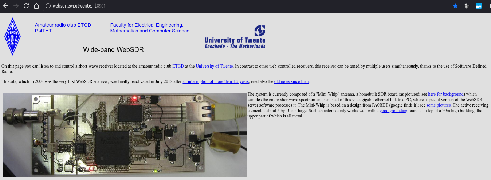
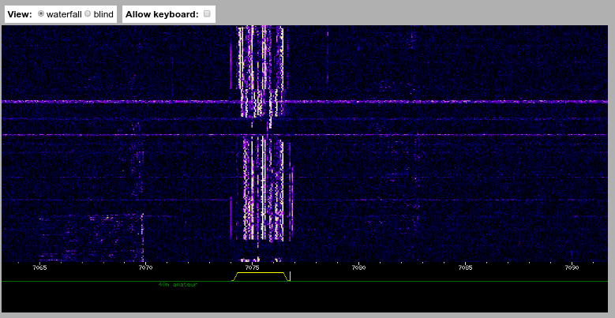
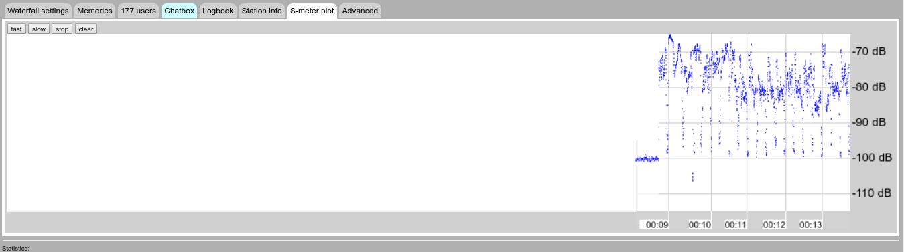
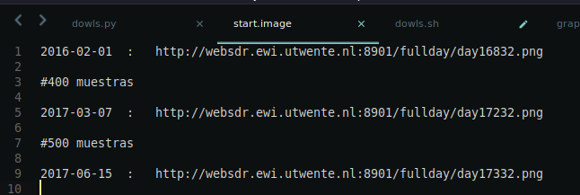
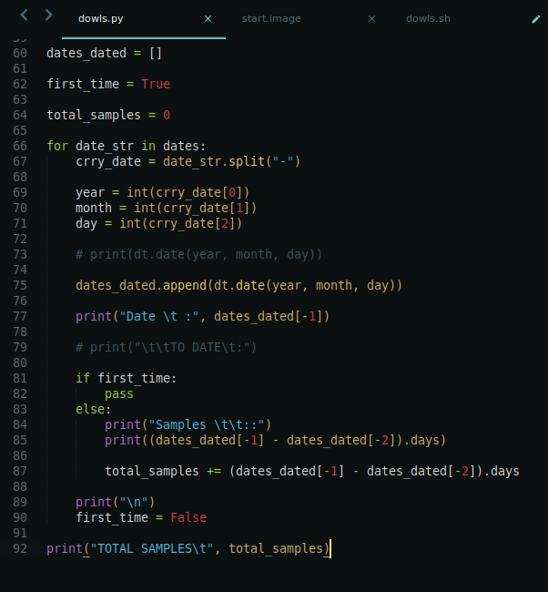

# Image Processing Project

Full Title:

**
  Comparison of Image Enhancement Techniques applied to Sound Data Retrive ( from Images )
**

When a wave-type signal is capture , it in his raw state, can be representated in multiple ways, but , if it is a sound, despite the fact it just electrical field pertubations, can be also representated as an image; an image who contain the same informatino as the sound but in other domains. (could have less informatio tho)

# Student Information

* **Name**: Jahir Gilberth Medina Lopez
* **USP Number**: 1659682

# Description and Plan Structure

## Project Area(s) : 

### Main Area
  * Super-Resolution
### Secondariy Area(S)
  * Feature Extraction
  * In-painting
  * Noise Reduction [*]

[*] As an auxiliary topic.

## Project Context:

The University of Twente posses a short-wave receiver located at the amateur radio club ETGD, and it is public access.

They allow the possibility of multiple tune-it radio frequency, generating a wide spectrum of available frequencies [0 Mhz - ~30 Mhz]

Like it is looks, the image resulting of a complete day of frequencies registering posses a relative "pattern" behavior, despite it contents a lot of voice signals [ 0Mhz - 15 Mhz ].

## Project Objective(s):
  * Find a correlation between "General Data" ( 24h Images), "Detailed Data" (1min Images) and "Specific Data" (Sound) in the process of pattern recognicion.

  

  

  [Specific Data (Sound File Sample)](./md-media/audio_player.html)

<audio controls="controls">
  <source type="audio/mp3" src="./websdr_recording_start_2018-05-17T00_10_41Z_7076.8kHz.mp3"></source>
  <source type="audio/ogg" src="./websdr_recording_start_2018-05-17T00_10_41Z_7076.8kHz.ogg"></source>
  
Your browser does not support the audio element.

</audio>

  * Improve the image quality (register along 1 day) , focusing in the "pattern behaviored" areas (for example at the 27550 MHz Frequency), making more easy the feature extraction process.

  * The Feature Extraction process it gona be performed in a more detailed image (1 min images), and usit as a correctness proof.

## Possible Solutions Steps:
  * Retrive all the possible "General Data" [Picture Above] (400 ~ 500 samples)
  
  

  

  * Split the data in "Detailed Data" Sizes
  * Find Match between all of them (same pattern) an proceed to increase de resolution
  * Re-Generates a "General Data" image.
  
  > Speculative Steps
  
  * Applys an CNN
  * Applys an SVM
  
  > Fix Steps
  
  * Compare the behavior of the same data at diferent levels (General, Detailed, Specific) and contrast his Features or the information available in every one of them.
